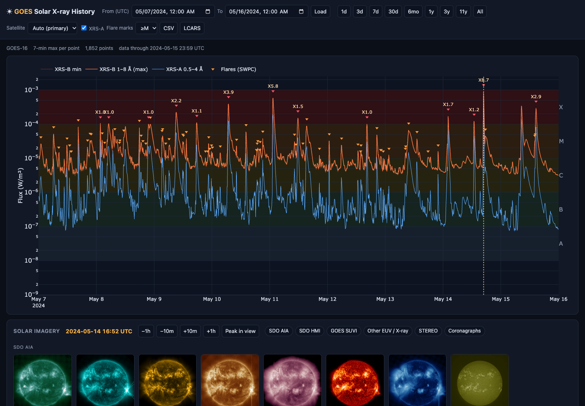
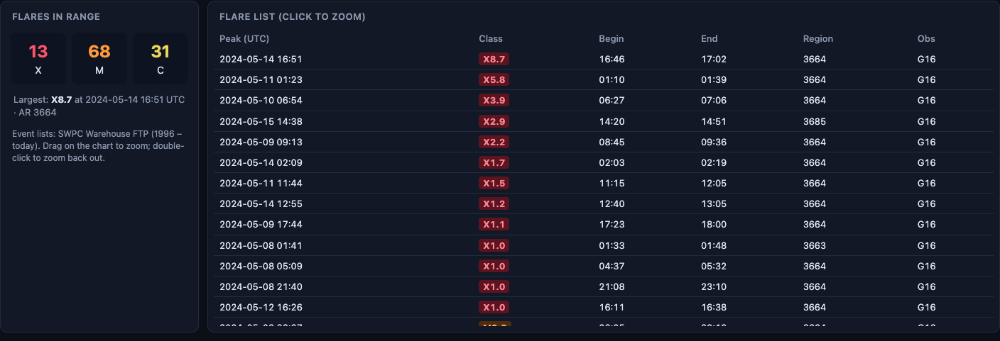
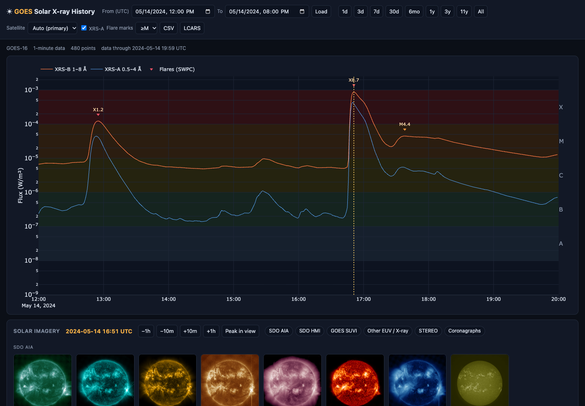
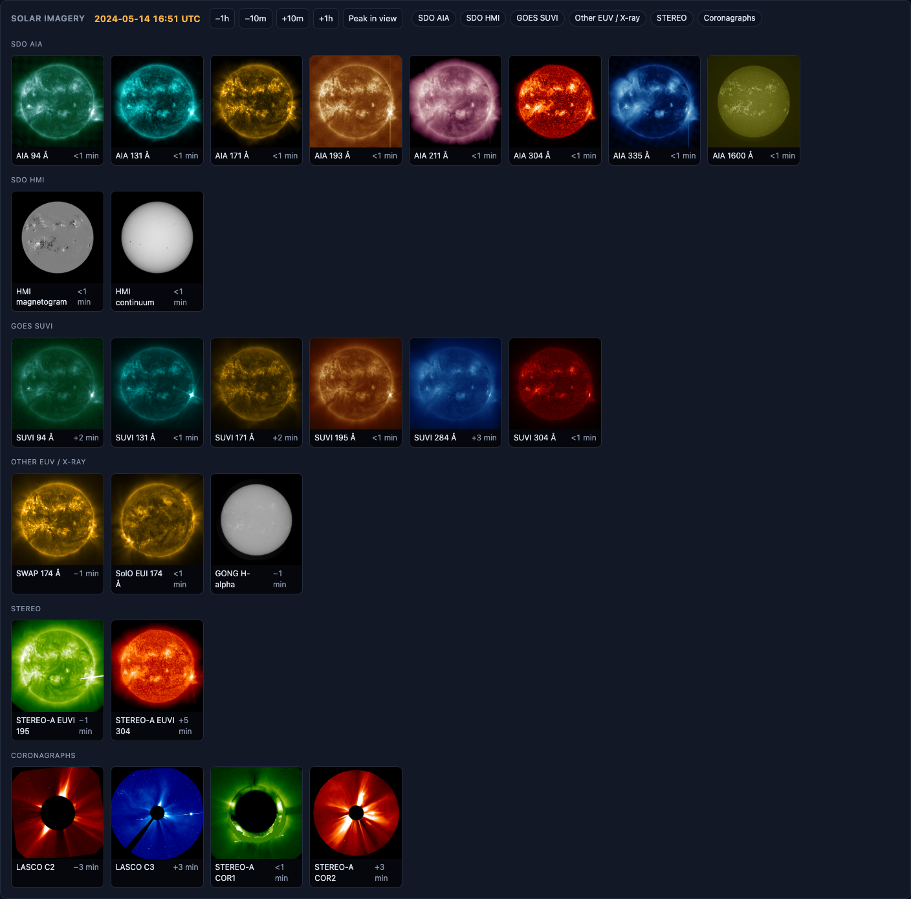
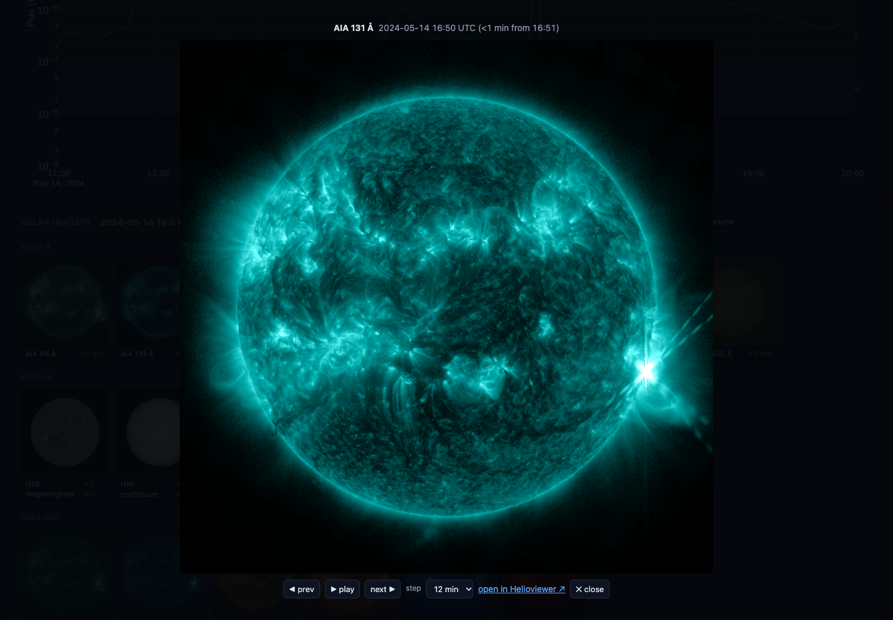
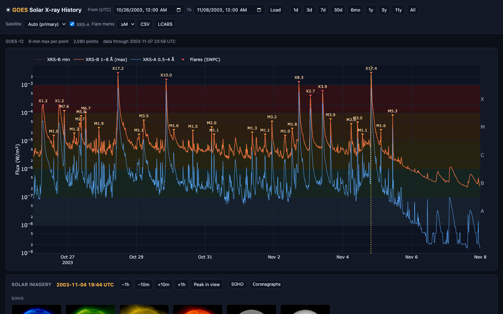
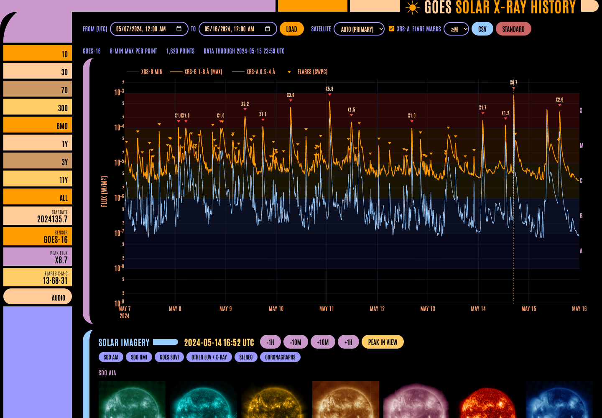
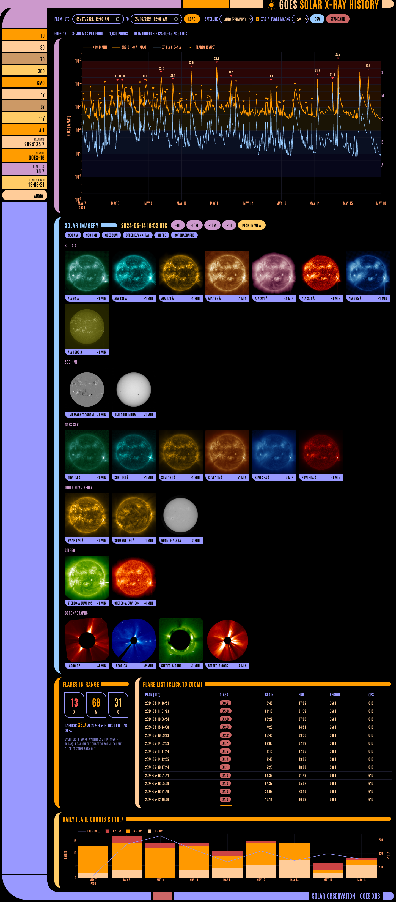

# ☀️ Solar X-ray History

**Browse GOES solar X-ray flux from 1995 to today, not only the last 7 days.**

NOAA's [GOES X-ray Flux](https://www.swpc.noaa.gov/products/goes-x-ray-flux) page only shows the past week.
Solar X-ray History is a small local web app that pulls the full archive on demand. It plots any time window
from minutes to decades, marks every flare, and shows images of the Sun from every spacecraft that was
watching at the moment you click.



## Features

- **30 years of X-ray flux.** The 1–8 Å (XRS-B) and 0.5–4 Å (XRS-A) channels from GOES-8 through GOES-19,
  1995 → now, with the last few hours filled in from SWPC's live feed.
- **Zoom from decades to minutes.** Drag on the chart and it refetches at full 1-minute resolution. For long
  ranges each point keeps the **maximum** flux in its time bucket, so flare peaks are never averaged away.
- **Flare catalogue.** Every C/M/X flare from SWPC's edited event lists (1996 → today) is marked on the chart
  and listed in a sortable table with begin/peak/end times and active region. Click a flare to zoom to it.
- **Solar imagery at any moment.** Click anywhere on the chart to see images from every sensor imaging at that
  time: SDO AIA & HMI, GOES SUVI, SOHO EIT/MDI/LASCO, STEREO, PROBA2, Hinode, GONG, TRACE, Yohkoh and more.
  Enlarge any image and step or play through time.
- **Daily summary.** Flare counts per day and F10.7 radio flux.
- **CSV export** of the 1-minute data, and **bookmarkable views** (the time window is kept in the URL).
- **LCARS skin.** One click turns the interface into a starship-style console.
- Everything is fetched **on demand and cached locally**. No accounts or API keys.

## Install

**Requirements:** Python 3.10 or newer, and an internet connection. The app is developed on macOS and should
work on Linux too.

```bash
git clone https://github.com/Lone-Star-Observatories/solarhist.git
cd solarhist
./run.sh
```

On first run, `run.sh` creates a virtual environment in `.venv` and installs the dependencies. It uses
[uv](https://github.com/astral-sh/uv) if you have it, otherwise `python3 -m venv` + `pip`. It then starts the
server and opens **http://127.0.0.1:8765** in your browser.

<details>
<summary>Manual install (without run.sh)</summary>

```bash
python3 -m venv .venv
.venv/bin/pip install -r requirements.txt
.venv/bin/python -m uvicorn solarhist.server:app --host 127.0.0.1 --port 8765
```
</details>

**Options** (environment variables for `run.sh`):

| Variable | Default | Meaning |
|---|---|---|
| `PORT` | `8765` | Port to listen on |
| `HOST` | `127.0.0.1` | Address to bind. Use `0.0.0.0` to allow other machines on your network |
| `NO_OPEN` | *(unset)* | Set to any value to skip opening the browser |

Stop the server with **Ctrl-C**.

## Using it

### Pick a time window
- **Presets:** `1d` `3d` `7d` `30d` `6mo` `1y` `3y` `11y` (a full solar cycle) and `All` (1995 → now).
- **Custom range:** type From/To dates (UTC) and press **Load**.
- **Zoom:** drag across the chart. **Double-click** zooms out ×4.
- **Satellite:** `Auto` uses the operational primary GOES for each period. You can also pick a specific
  satellite (GOES-8 … 19), for example to compare GOES-16 and GOES-18.
- **Flare marks:** show flares ≥X, ≥M, ≥C, or turn them off. **XRS-A** toggles the short-wavelength channel.

The status line shows which satellite the data came from, the resolution (e.g. "7-min max per point"), and
how recent the data is.

> The first time you view a period, the app downloads it from NOAA. That's about 30 MB per year for
> GOES-16 and later, and about 365 small daily files per year for older satellites, so expect anywhere from a
> few seconds to a minute. The status line shows progress. After that the period loads instantly from cache.

### Flares



The panel under the chart counts X/M/C flares in the current window and shows the largest one. Click any
column header to sort the list. Click a flare to zoom the chart to ±4 hours around it and load the images
at its peak.



### Solar imagery

Click anywhere on the chart, or on a flare, to choose a moment. A dotted line marks it on the chart, and the
imagery panel shows the closest image from every sensor that was operating then.



- Each tile shows how far its image is from the selected time. It turns amber when the gap is over 15 minutes.
  Sensors with nothing close enough are left out.
- **−1h / −10m / +10m / +1h** move the selected time. **Peak in view** jumps to the highest X-ray flux
  currently on the chart.
- The chips (SDO AIA, GOES SUVI, Coronagraphs, …) hide or show groups of sensors. The app remembers your choice.
- **Click a tile** to open it large. Use **◀ prev / next ▶** (or ← →) to step through time, and **▶ play**
  (or space) to animate it, with a step of 2 min to 1 h. **Open in Helioviewer** opens that moment in
  Helioviewer for deeper analysis.



Which sensors appear depends on the date:

| Period | Sensors |
|---|---|
| 1991–2001 | Yohkoh SXT |
| 1996 → | SOHO EIT, MDI (to 2011), LASCO C2/C3 coronagraphs |
| 1998–2010 | TRACE |
| 2006 → | STEREO-A (STEREO-B to 2014) EUVI and COR1/COR2, Hinode XRT |
| 2010 → | SDO AIA (8 wavelengths) and HMI, PROBA2 SWAP |
| 2015 → | GONG H-alpha |
| 2020–2025 | Solar Orbiter EUI |
| 2022 → | GOES SUVI (6 wavelengths), GOES CCOR-1 coronagraph (2025 →) |

Even old events get imagery. Here are the 2003 "Halloween storms", from GOES-12 and SOHO:



### Export data
**CSV** downloads the 1-minute data for the current window (time, XRS-A, XRS-B, satellite), up to 400 days
per file. Zoom in first if the window is longer.

### Bookmark or share a view
The URL holds the window and satellite, e.g.
`http://127.0.0.1:8765/#s=2024-05-14T12:00:00&e=2024-05-14T20:00:00&sat=auto`.

### LCARS skin

Press **LCARS** in the header (or open `/?skin=lcars`) for a starship-console look. The time presets move into
the sidebar, and live readouts show the selected time, active sensor, peak flux and flare counts. **AUDIO**
toggles the console chirps. Press **Standard** to switch back; the app remembers which skin you used last.



<details>
<summary>Full LCARS page</summary>


</details>

## Where the data comes from

All sources are public and free. Nothing needs an account or key.

| Data | Source | Coverage |
|---|---|---|
| 1-min XRS flux, GOES-16/17/18/19 | NOAA NCEI: [`data.ngdc.noaa.gov/…/goes/`](https://data.ngdc.noaa.gov/platforms/solar-space-observing-satellites/goes/) (yearly `xrsf-l2-avg1m_science` files) | 2017 → yesterday |
| 1-min XRS flux, GOES-8…15 | NOAA NCEI: [GOES SEM science XRS](https://www.ncei.noaa.gov/data/goes-space-environment-monitor/access/science/xrs/) (daily files) | 1995 → 2020 |
| Latest hours | NOAA SWPC [7-day JSON](https://services.swpc.noaa.gov/json/goes/primary/xrays-7-day.json) | last 7 days |
| Flare event lists | NOAA SWPC Warehouse FTP `ftp.swpc.noaa.gov/pub/warehouse` (`YYYY_events`) | 1996 → today |
| F10.7 / sunspot number | SWPC Warehouse `YYYY_DSD.txt` | 1996 → last full year |
| Solar images | [Helioviewer API](https://api.helioviewer.org/docs/v2/) (`getClosestImage`, `takeScreenshot`) | 1991 → now |

**Auto satellite selection**: GOES-8 (1995–2003) → GOES-12 (2003–2007) → GOES-10 (2008–09) →
GOES-15 (2010–2017) → GOES-16 (2017–2025) → GOES-19 (2025 →). If the primary has no data for a month,
the app falls back to the other satellites that were operating.

**Cache:** downloads are converted to compact Parquet files in `cache/flux/`, event lists to `cache/events/`,
and rendered images to `cache/img/`. Past periods are cached for good. The current month or year is refreshed
every 6 hours, and recent event lists every 30 minutes. Delete `cache/` at any time to start fresh.

## Notes on the data

- **Science-quality values.** For GOES-8…15, NOAA's reprocessed data removes the old SWPC scaling factors.
  Their 1–8 Å flux is about 1.4× (and 0.5–4 Å about 1.18×) the values in SWPC's historical plots, which puts
  them on the same scale as GOES-16 and later.
- **Event lists are preliminary.** They are SWPC's operational reports. For example, the 2003-11-04 flare is
  listed as X17.4 because the detector saturated. It was later re-estimated at about X28, and the science
  flux curve reconstructs it at about X25.
- **Gaps.** Eclipse seasons, calibrations and instrument changes leave short gaps. Values flagged as bad by
  NOAA are not plotted.
- **Times are UTC everywhere.**

## HTTP API

The UI is a single static page on top of a small JSON API that you can also call directly:

| Endpoint | Returns |
|---|---|
| `GET /api/flux?start=…&end=…&sat=auto&points=3000` | Downsampled flux: `t` (ms), `b`, `a`, `bmin`, `step_min`, `sats` |
| `GET /api/flares?start=…&end=…&min_class=C` | Flare list from the SWPC event reports |
| `GET /api/daily?start=…&end=…` | Daily C/M/X counts, F10.7, sunspot number |
| `GET /api/images?time=…` | Closest image per sensor near a time |
| `GET /api/img?key=aia131&date=…&size=512` | Rendered PNG for one sensor (cached) |
| `GET /api/export.csv?start=…&end=…&sat=auto` | 1-minute CSV |
| `GET /api/status` | Download progress and cache size |

Times are ISO 8601 in UTC, e.g. `2024-05-14T16:51:00`.

## Project layout

```
solarhist/
├── run.sh               # one-step setup + launch
├── requirements.txt
├── solarhist/
│   ├── core.py          # NOAA flux fetch/cache/downsample, SWPC FTP events & daily data
│   ├── images.py        # Helioviewer sensor catalogue, closest-image lookup, PNG cache
│   └── server.py        # FastAPI app and JSON endpoints
├── static/
│   ├── index.html       # the whole UI (Plotly charts, imagery panel, both skins)
│   └── vendor/plotly.min.js
└── docs/screenshots/
```

## Credits

- X-ray data: **NOAA NCEI** and the **NOAA Space Weather Prediction Center**, from the GOES XRS and EXIS
  instruments.
- Solar imagery via **[Helioviewer](https://helioviewer.org)** (ESA/NASA). Image data courtesy of the NASA
  SDO, ESA/NASA SOHO, NASA STEREO, ESA PROBA2, JAXA/NASA Hinode, NOAA GOES SUVI/CCOR, NSO GONG, NASA TRACE,
  ISAS Yohkoh and ESA/NASA Solar Orbiter teams.
- Charts by [Plotly.js](https://plotly.com/javascript/) (MIT, vendored in `static/vendor`). The LCARS skin
  uses the [Antonio](https://fonts.google.com/specimen/Antonio) font (SIL OFL) from Google Fonts.
- The LCARS skin is an unofficial, fan-made tribute. *Star Trek* and LCARS are trademarks of CBS Studios /
  Paramount. This project is not affiliated with or endorsed by them.

## License

[MIT](LICENSE) © 2026 Lone Star Observatories
